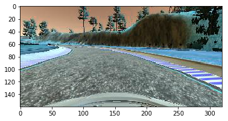
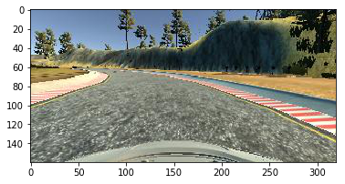
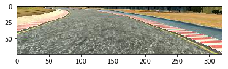
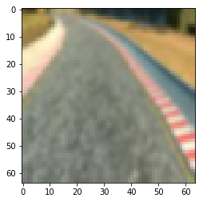
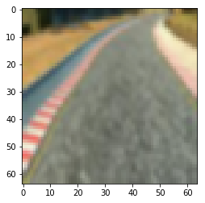
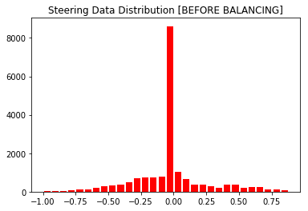
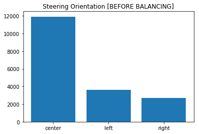
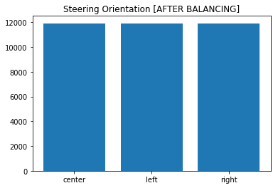
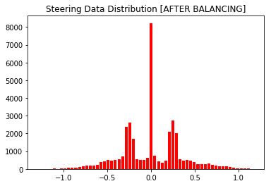

# Behavioral Cloning Model for a Simulated Self-Driving Car
The goal of this project is to train a model to navigate a vehicle across a track on it's own. Using Udacity's vehicle simulation, I'll first manually navigate a vehicle around a track a few times, while gathering corresponding image + input data. Next, I'll take the appropriate measures to preprocess the data that will be used to train a generalized CNN model that will navigate across the track on it's own.

### Import Dependencies


```python
import csv,cv2,random,time,math
from keras.layers import Dense, Flatten, Lambda, Convolution2D, pooling, MaxPooling2D, Cropping2D, Dropout
from keras.models import Sequential
from keras.optimizers import Adam
from keras.regularizers import l2
from sklearn.utils import shuffle
from sklearn.model_selection import train_test_split
import matplotlib.pyplot as plt
import numpy as np
```

    Using TensorFlow backend.
    

### Load Driving Data


```python
use_my_data = True
    
if use_my_data:
    path_split = '\\'
    folder_path = './my_track_data/'
else:
    path_split = '/'
    folder_path = './provided_track_data/'

log_list = []
with open(folder_path + 'driving_log.csv') as driving_log:
    reader = csv.reader(driving_log)
    for line in reader:
        log_list.append(line)

log_list = log_list[1:]
len(log_list)
```


    18237


### Define and Display a Test Image


```python
# retrieve test image from log
test_log = log_list[42]
center_image_path = folder_path + 'IMG/' + test_log[0].split(path_split)[-1]
test_image = cv2.imread(center_image_path)
plt.imshow(test_image)
```


    <matplotlib.image.AxesImage at 0x2245f1d2cc0>





### Convert BGR Images to RGB
Training data is recorded in BGR, while the drive.py file (used to run the automated simulation of training model) uses RGB. Thus, we need this conversion function to convert all our images to RGB prior to training.


```python
def bgr_to_rgb(img):
    return cv2.cvtColor(img,cv2.COLOR_BGR2RGB)

test_image_rgb = bgr_to_rgb(test_image)
plt.imshow(test_image_rgb)
```


    <matplotlib.image.AxesImage at 0x2245f24d748>





### Crop Top/Bottom Parts of Training Images
Removing portions of the image helps to focus on whats really important (the road).


```python
def crop(img):
    return img[60:135,:,:]

test_image_crop = crop(test_image_rgb)
plt.imshow(test_image_crop)
```


    <matplotlib.image.AxesImage at 0x2245f2924a8>





### Resize Images Down to 64x64
This helps to reduce the memory load and complexity of a training model.


```python
def resize(img):
    return cv2.resize(img,(64, 64), interpolation = cv2.INTER_AREA)

test_image_resize = resize(test_image_crop)
plt.imshow(test_image_resize)
```


    <matplotlib.image.AxesImage at 0x2245f2c95f8>


### Apply Gaussian Blur
Blurring the images helps to generalize the roads better.


```python
def blur(img):
    # apply blur
    return cv2.GaussianBlur(img, (3,3), 0)

test_image_blur = blur(test_image_resize)
plt.imshow(test_image_blur)
```


    <matplotlib.image.AxesImage at 0x2245f307978>





### Apply Random Brightness
Providing variations on the image brightness (lighter/darker) can also have a signficant impact on generalizing the model.


```python
# brightness isn't applied to images until we utilize our data_generator
def random_brightness(img):
    hsv_img = cv2.cvtColor(img,cv2.COLOR_RGB2HSV)
    brightness = random.uniform(0.35,1.0)
    hsv_img[:,:,2] = hsv_img[:,:,2]*brightness
    return cv2.cvtColor(hsv_img,cv2.COLOR_HSV2RGB)

test_image_brighten = random_brightness(test_image_blur)
plt.imshow(test_image_brighten)
```


    <matplotlib.image.AxesImage at 0x2245f34a630>


### Flip Images
This is an effective way of augmenting data in the opposite direction. Also, improves model generalization.


```python
def flip(img):
    return cv2.flip(img,1)

test_image_flip = flip(test_image_brighten)
plt.imshow(test_image_flip)
```


    <matplotlib.image.AxesImage at 0x2245f3877b8>





### Load Images with Augmentation
For the sake of minimizing computational overhead, all images go through the following pipeline:
1. Read in the data using cv2.imread() -- size: 160x320x3
2. Crop top/bottom sections of image -- size: 75x320x3
3. Resize the image to save on memory -- size: 64x64x3
4. Conver to RGB -- size: 64x64x3
5. Blur image -- size:64x64x3

For each frame in the logged data, we also have a left/right image which is slightly off center. We can use these off-center images to effectively generalize our learning model better. But for now, I'll rely on the center image data to see how well the steering data is distributed first. Later, I'll fill in the gaps (imbalances in data preference to turn right/left) using the left/right image data.


```python
center_images,other_images = [],[]
center_steering,other_steering = [],[]
time_log = time.time()
for i,log in enumerate(log_list):
    if i % 1000 == 0:
        print('')
        print('lines_processed: {}, lines_left: {}, n_center_images_collected: {}, time_elapsed_since_last_step: {:.4f}'.format(i,len(log_list)-i,len(center_images),time.time()-time_log))
        time_log = time.time()
    if i % 50 == 0:
        print('-',end='')

    center_image_path = folder_path + 'IMG/' + log[0].split(path_split)[-1]
    left_image_path = folder_path + 'IMG/' + log[0].split(path_split)[-1]
    right_image_path = folder_path + 'IMG/' + log[0].split(path_split)[-1]
    
    center_image = blur(bgr_to_rgb(resize(crop(cv2.imread(center_image_path)))))
    left_image = blur(bgr_to_rgb(resize(crop(cv2.imread(left_image_path)))))
    right_image = blur(bgr_to_rgb(resize(crop(cv2.imread(right_image_path)))))
    
    # record input commands
    steering,thrust,brake = float(log[3]),float(log[4]),float(log[5])

    correction = random.uniform(0.20,0.30)

    center_images.append(center_image)
    center_steering.append(steering)
    other_images.extend([left_image,right_image])
    other_steering.extend([steering+correction,steering-correction])

# convert lists to numpy arrays
X_center,y_center = np.array(center_images),np.array(center_steering)
X_other,y_other = np.array(other_images),np.array(other_steering)

print('')
print('lines_processed: {}, lines_left: {}, n_center_images_collected: {}, time_elapsed_since_last_step: {:.4f}'.format(i,len(log_list)-i,len(center_images),time.time()-time_log))
print('X_center shape: {}, y_center shape: {}; X_other shape: {}, y_other shape: {}'.format(X_center.shape,y_center.shape,X_other.shape,y_other.shape))
```

    
    lines_processed: 0, lines_left: 18237, n_center_images_collected: 0, time_elapsed_since_last_step: 0.0000
    --------------------
    lines_processed: 1000, lines_left: 17237, n_center_images_collected: 1000, time_elapsed_since_last_step: 4.6096
    --------------------
    lines_processed: 2000, lines_left: 16237, n_center_images_collected: 2000, time_elapsed_since_last_step: 4.5217
    --------------------
    lines_processed: 3000, lines_left: 15237, n_center_images_collected: 3000, time_elapsed_since_last_step: 4.5355
    --------------------
    lines_processed: 4000, lines_left: 14237, n_center_images_collected: 4000, time_elapsed_since_last_step: 4.5092
    --------------------
    lines_processed: 5000, lines_left: 13237, n_center_images_collected: 5000, time_elapsed_since_last_step: 4.5910
    --------------------
    lines_processed: 6000, lines_left: 12237, n_center_images_collected: 6000, time_elapsed_since_last_step: 4.5131
    --------------------
    lines_processed: 7000, lines_left: 11237, n_center_images_collected: 7000, time_elapsed_since_last_step: 4.5427
    --------------------
    lines_processed: 8000, lines_left: 10237, n_center_images_collected: 8000, time_elapsed_since_last_step: 4.6389
    --------------------
    lines_processed: 9000, lines_left: 9237, n_center_images_collected: 9000, time_elapsed_since_last_step: 4.5420
    --------------------
    lines_processed: 10000, lines_left: 8237, n_center_images_collected: 10000, time_elapsed_since_last_step: 4.5385
    --------------------
    lines_processed: 11000, lines_left: 7237, n_center_images_collected: 11000, time_elapsed_since_last_step: 4.4530
    --------------------
    lines_processed: 12000, lines_left: 6237, n_center_images_collected: 12000, time_elapsed_since_last_step: 4.5025
    --------------------
    lines_processed: 13000, lines_left: 5237, n_center_images_collected: 13000, time_elapsed_since_last_step: 4.5578
    --------------------
    lines_processed: 14000, lines_left: 4237, n_center_images_collected: 14000, time_elapsed_since_last_step: 4.4865
    --------------------
    lines_processed: 15000, lines_left: 3237, n_center_images_collected: 15000, time_elapsed_since_last_step: 4.5623
    --------------------
    lines_processed: 16000, lines_left: 2237, n_center_images_collected: 16000, time_elapsed_since_last_step: 4.4914
    --------------------
    lines_processed: 17000, lines_left: 1237, n_center_images_collected: 17000, time_elapsed_since_last_step: 4.4804
    --------------------
    lines_processed: 18000, lines_left: 237, n_center_images_collected: 18000, time_elapsed_since_last_step: 4.5255
    -----
    lines_processed: 18236, lines_left: 1, n_center_images_collected: 18237, time_elapsed_since_last_step: 1.4002
    X_center shape: (18237, 64, 64, 3), y_center shape: (18237,); X_other shape: (36474, 64, 64, 3), y_other shape: (36474,)
    

### Steering Data Distribution Prior to Balancing


```python
n_bins = 30
y_freq, y_bins, ignored = plt.hist(y_center,color='r',bins=n_bins,rwidth=0.8)
plt.title('Steering Data Distribution [BEFORE BALANCING]')
plt.show()
```





Clearly there's an disproportionate amount of data for values that fall within the 0 (+-0.10) range. This skew creates a bias in the vehicles steering, which translates to poor performance when it comes to turning around curves on the track. Thus, it might be beneficial to be more selective in our training data and attempt to maintain a more uniform distribution across the various ranges of steering data. This preprocessing step would allow our model to generalize much better allowing it to become much more responsive to curves in the track.


```python
offset = 0.17
y_center_steer_left_index = y_center < -offset # turning left
y_center_steer_center_index = (y_center > -offset) & (y_center < offset) # mostly central
y_center_steer_right_index = (y_center > offset) # turning right

y_other_steer_left_index = y_other < -offset # turning left
y_other_steer_center_index = (y_other > -offset) & (y_other < offset) # mostly central
y_other_steer_right_index = (y_other > offset) # turning right

y_left_count,y_center_count,y_right_count = sum(y_center_steer_left_index),sum(y_center_steer_center_index),sum(y_center_steer_right_index)
print('[BEFORE BALANCING]: left steering: {}, center steering: {}, right steering: {}'.format(y_left_count,y_center_count,y_right_count))
print('[BEFORE BALANCING]: X_data shape: {}, y_data shape: {}, y_mean: {:.4f}, y_std: {:.4f}'.format(X_center.shape,y_center.shape,np.mean(y_center),np.std(y_center)))
```

    [BEFORE BALANCING]: left steering: 3619, center steering: 11918, right steering: 2700
    [BEFORE BALANCING]: X_data shape: (18237, 64, 64, 3), y_data shape: (18237,), y_mean: -0.0114, y_std: 0.2715
    


```python
plt.bar(['left','center','right'],[y_left_count,y_center_count,y_right_count],)
plt.title('Steering Orientation [BEFORE BALANCING]')
plt.show()
```





### Balancing Steering Data
A well balanced training data is essential to training a ML model because the bias apparent in the data will ultimately have an impact on the performance of the model. Thus, if we have more image data for the car turning left (becuse the track is traversed in a counter-clockwise direction), then the training model will also have a preference to the left. This unbalance in the data will result in the car pulling more to the left.

Therefore, I determined the general orientation of the dataset and filled in the gaps by using data that was acquired from the left/right camera images.


```python
# calculate count difference between left/center data, and right/center data
diff_left = y_center_count - y_left_count
diff_right = y_center_count - y_right_count

# all data is consolidated into these two lists
X_data_list,y_data_list = [],[]

# extend original center image/steering data
X_data_list.extend(X_center)
y_data_list.extend(y_center)

# add left/right image/steering data to balance out the data bias
X_data_add_right,y_data_add_right = shuffle(X_other[y_other_steer_right_index],y_other[y_other_steer_right_index],n_samples=diff_right)
X_data_add_left,y_data_add_left = shuffle(X_other[y_other_steer_left_index],y_other[y_other_steer_left_index],n_samples=diff_left)

# extend additional image/steering data
X_data_list.extend(X_data_add_right)
y_data_list.extend(y_data_add_right)
X_data_list.extend(X_data_add_left)
y_data_list.extend(y_data_add_left)

# convert lists into a numpy array
X_data = np.array(X_data_list)
y_data = np.array(y_data_list)

# save fully processed and balanced X and y data to local disk
np.save('X_data',X_data)
np.save('y_data',y_data)
```

### Before and After Comparison of Steering Angle Balancing
The steering data prior to balancing to after:
* BEFORE: y_mean: -0.0114, y_std: 0.2715
* AFTER: y_mean: 0.0016, y_std: 0.3402

Prior to balancing our data, the data had a 0.0114 degree preference to the left and a narrow variance of 0.2715. To balance out the angle of the steering data in the model, I used the left/right images to fill the gap (difference from center count to left/right count). 

After we applied the balancing step, the y_mean (steering angle) is much closer to 0, indicating a more even distribution of the steering angle data. In addition, the variance appears to be slightly larger as well. A higher variance is desirable in this case because this allows the model to be well-rounded, rather than having a preference to any given angle.


```python
y_steer_left_index = y_data < -offset # turning left
y_steer_center_index = (y_data > -offset) & (y_data < offset) # mostly central
y_steer_right_index = (y_data > offset) # turning right

y_left_count,y_center_count,y_right_count = sum(y_steer_left_index),sum(y_steer_center_index),sum(y_steer_right_index)
print('[AFTER BALANCING]: left steering: {}, center steering: {}, right steering: {}'.format(y_left_count,y_center_count,y_right_count))
print('[AFTER BALANCING]: X_data shape: {}, y_data shape: {}, y_mean: {:.4f}, y_std: {:.4f}'.format(X_data.shape,y_data.shape,np.mean(y_data),np.std(y_data)))
```

    [AFTER BALANCING]: left steering: 11918, center steering: 11918, right steering: 11918
    [AFTER BALANCING]: X_data shape: (35754, 64, 64, 3), y_data shape: (35754,), y_mean: 0.0016, y_std: 0.3402
    


```python
plt.bar(['left','center','right'],[y_left_count,y_center_count,y_right_count],)
plt.title('Steering Orientation [AFTER BALANCING]')
plt.show()
```





Although the general steering orientation appears to have leveled out and the mean has converged closer to zero, the histogram tells us a slightly different story. The histogram is a lot more balanced then it was before, however, it's not perfectly symmetrical. We'll focus on this in the next section.


```python
freq,bins,_ = plt.hist(y_data,color='r',bins=n_bins*2,rwidth=0.8)
plt.title('Steering Data Distribution [AFTER BALANCING]')
plt.show()
```





### Load Data, Shuffle, and Split for Training/Validation


```python
# load X & y data and shuffle
X_data = np.load('X_data.npy')
y_data = np.load('y_data.npy')
X_data,y_data = shuffle(X_data,y_data,n_samples=10000)

# split the data up for training/testing
X_train, X_valid, y_train, y_valid = train_test_split(X_data, y_data, test_size = 0.20, random_state = 42)

print('[TRAINING AND VALIDATION DATA]: X_train shape: {}, y_train shape: {}, X_valid shape: {}, y_valid shape: {}'.format(X_train.shape,y_train.shape,X_valid.shape,y_valid.shape))
print('[TRAINING AND VALIDATION DATA]: y_train mean: {:.4f}, y_train std: {:.4f}, y_valid mean: {:.4f}, y_valid std: {:.4f}'.format(np.mean(y_train),np.std(y_train),np.mean(y_valid),np.std(y_valid)))
```

    [TRAINING AND VALIDATION DATA]: X_train shape: (8000, 64, 64, 3), y_train shape: (8000,), X_valid shape: (2000, 64, 64, 3), y_valid shape: (2000,)
    [TRAINING AND VALIDATION DATA]: y_train mean: 0.0025, y_train std: 0.3353, y_valid mean: -0.0080, y_valid std: 0.3442
    

### Generators
These generator functions were developed to minimize the memory load on the GPU. In addition, the generator helps to generalize the model by applying the following steps:
* Brightness adjustment to all batch images using the random_brightness() method
* Slight angle variation to all steering angles (90%-110% of original steering angle)
* Flip batch images and steering angles horizontally (only applied to 50% of the batch images)


```python
# model generators used to minimize memory usage when training model
def train_generator(X,y,batch_size):
    X_batch = np.zeros((batch_size, 64, 64, 3), dtype = np.float32)
    y_batch = np.zeros((batch_size,), dtype = np.float32)
    X_shuffled, y_shuffled = shuffle(X, y)
    while True:
        for i in range(batch_size):
            rand = int(np.random.choice(len(X_shuffled),1))
            X_batch[i] = random_brightness(X_shuffled[rand])
            y_batch[i] = y_shuffled[rand]*np.random.uniform(0.90,1.10)

            coin = random.randint(0,1)
            if coin == 1:
                X_batch[i], y_batch[i] = flip(X_batch[i]),-1*y_batch[i]

        yield X_batch, y_batch

# model generators used to minimize memory usage when training model
def valid_generator(X,y,batch_size):
    X_batch = np.zeros((batch_size, 64, 64, 3), dtype = np.float32)
    y_batch = np.zeros((batch_size,), dtype = np.float32)
    X_shuffled, y_shuffled = shuffle(X, y)
    while True:
        for i in range(batch_size):
            rand = int(np.random.choice(len(X_shuffled),1))
            X_batch[i] = X_shuffled[rand]
            y_batch[i] = y_shuffled[rand]

        yield X_batch, y_batch
```

### Hyperparameters and Model Pipeline
The following hyper-parameters were selected for our model:
* BATCH_SIZE = 128
* EPOCHS = 5
* LR = 0.001


```python
# model hyperparameters
BATCH_SIZE = 128
EPOCHS = 3
LR = 0.001

# initialize generators
train_gen = train_generator(X_train, y_train, BATCH_SIZE)
valid_gen = valid_generator(X_valid, y_valid, BATCH_SIZE)

# NVIDIA INSPIRED NETWORK ARCHITECTURE
model = Sequential()
model.add(Lambda(lambda x: (x/255) - 0.5,input_shape=X_train.shape[1:])) # normalization layer
model.add(Convolution2D(24, 5, 5, border_mode='valid', subsample=(2,2), activation='relu', W_regularizer = l2(LR)))
model.add(Convolution2D(36, 5, 5, border_mode='valid', subsample=(2,2), activation='relu', W_regularizer = l2(LR)))
model.add(Convolution2D(48, 5, 5, border_mode='valid', subsample=(2,2), activation='relu', W_regularizer = l2(LR)))
model.add(Convolution2D(64, 3, 3, border_mode='same', subsample=(2,2), activation='relu', W_regularizer = l2(LR)))
model.add(Convolution2D(64, 3, 3, border_mode='valid', subsample=(2,2), activation='relu', W_regularizer = l2(LR)))
model.add(Flatten())
model.add(Dense(80, W_regularizer = l2(LR)))
model.add(Dropout(0.5))
model.add(Dense(40, W_regularizer = l2(LR)))
model.add(Dropout(0.5))
model.add(Dense(20, W_regularizer = l2(LR)))
model.add(Dropout(0.5))
model.add(Dense(10, W_regularizer = l2(LR)))
model.add(Dense(1, W_regularizer = l2(LR)))
model.compile(optimizer='adam', loss='mse', metrics=['accuracy'])
model.summary()
model.fit_generator(train_gen, samples_per_epoch = len(X_train), epochs=EPOCHS, validation_data=valid_gen, nb_val_samples = len(X_valid))
```

    C:\Users\Selim\Anaconda3\envs\tfenv\lib\site-packages\ipykernel_launcher.py:13: UserWarning: Update your `Conv2D` call to the Keras 2 API: `Conv2D(24, (5, 5), kernel_regularizer=<keras.reg..., activation="relu", strides=(2, 2), padding="valid")`
      del sys.path[0]
    C:\Users\Selim\Anaconda3\envs\tfenv\lib\site-packages\ipykernel_launcher.py:14: UserWarning: Update your `Conv2D` call to the Keras 2 API: `Conv2D(36, (5, 5), kernel_regularizer=<keras.reg..., activation="relu", strides=(2, 2), padding="valid")`
      
    C:\Users\Selim\Anaconda3\envs\tfenv\lib\site-packages\ipykernel_launcher.py:15: UserWarning: Update your `Conv2D` call to the Keras 2 API: `Conv2D(48, (5, 5), kernel_regularizer=<keras.reg..., activation="relu", strides=(2, 2), padding="valid")`
      from ipykernel import kernelapp as app
    C:\Users\Selim\Anaconda3\envs\tfenv\lib\site-packages\ipykernel_launcher.py:16: UserWarning: Update your `Conv2D` call to the Keras 2 API: `Conv2D(64, (3, 3), kernel_regularizer=<keras.reg..., activation="relu", strides=(2, 2), padding="same")`
      app.launch_new_instance()
    C:\Users\Selim\Anaconda3\envs\tfenv\lib\site-packages\ipykernel_launcher.py:17: UserWarning: Update your `Conv2D` call to the Keras 2 API: `Conv2D(64, (3, 3), kernel_regularizer=<keras.reg..., activation="relu", strides=(2, 2), padding="valid")`
    C:\Users\Selim\Anaconda3\envs\tfenv\lib\site-packages\ipykernel_launcher.py:19: UserWarning: Update your `Dense` call to the Keras 2 API: `Dense(80, kernel_regularizer=<keras.reg...)`
    C:\Users\Selim\Anaconda3\envs\tfenv\lib\site-packages\ipykernel_launcher.py:21: UserWarning: Update your `Dense` call to the Keras 2 API: `Dense(40, kernel_regularizer=<keras.reg...)`
    C:\Users\Selim\Anaconda3\envs\tfenv\lib\site-packages\ipykernel_launcher.py:23: UserWarning: Update your `Dense` call to the Keras 2 API: `Dense(20, kernel_regularizer=<keras.reg...)`
    C:\Users\Selim\Anaconda3\envs\tfenv\lib\site-packages\ipykernel_launcher.py:25: UserWarning: Update your `Dense` call to the Keras 2 API: `Dense(10, kernel_regularizer=<keras.reg...)`
    C:\Users\Selim\Anaconda3\envs\tfenv\lib\site-packages\ipykernel_launcher.py:26: UserWarning: Update your `Dense` call to the Keras 2 API: `Dense(1, kernel_regularizer=<keras.reg...)`
    C:\Users\Selim\Anaconda3\envs\tfenv\lib\site-packages\ipykernel_launcher.py:29: UserWarning: The semantics of the Keras 2 argument `steps_per_epoch` is not the same as the Keras 1 argument `samples_per_epoch`. `steps_per_epoch` is the number of batches to draw from the generator at each epoch. Basically steps_per_epoch = samples_per_epoch/batch_size. Similarly `nb_val_samples`->`validation_steps` and `val_samples`->`steps` arguments have changed. Update your method calls accordingly.
    C:\Users\Selim\Anaconda3\envs\tfenv\lib\site-packages\ipykernel_launcher.py:29: UserWarning: Update your `fit_generator` call to the Keras 2 API: `fit_generator(<generator..., epochs=3, validation_data=<generator..., validation_steps=2000, steps_per_epoch=8000)`
    

    _________________________________________________________________
    Layer (type)                 Output Shape              Param #   
    =================================================================
    lambda_1 (Lambda)            (None, 64, 64, 3)         0         
    _________________________________________________________________
    conv2d_1 (Conv2D)            (None, 30, 30, 24)        1824      
    _________________________________________________________________
    conv2d_2 (Conv2D)            (None, 13, 13, 36)        21636     
    _________________________________________________________________
    conv2d_3 (Conv2D)            (None, 5, 5, 48)          43248     
    _________________________________________________________________
    conv2d_4 (Conv2D)            (None, 3, 3, 64)          27712     
    _________________________________________________________________
    conv2d_5 (Conv2D)            (None, 1, 1, 64)          36928     
    _________________________________________________________________
    flatten_1 (Flatten)          (None, 64)                0         
    _________________________________________________________________
    dense_1 (Dense)              (None, 80)                5200      
    _________________________________________________________________
    dropout_1 (Dropout)          (None, 80)                0         
    _________________________________________________________________
    dense_2 (Dense)              (None, 40)                3240      
    _________________________________________________________________
    dropout_2 (Dropout)          (None, 40)                0         
    _________________________________________________________________
    dense_3 (Dense)              (None, 20)                820       
    _________________________________________________________________
    dropout_3 (Dropout)          (None, 20)                0         
    _________________________________________________________________
    dense_4 (Dense)              (None, 10)                210       
    _________________________________________________________________
    dense_5 (Dense)              (None, 1)                 11        
    =================================================================
    Total params: 140,829
    Trainable params: 140,829
    Non-trainable params: 0
    _________________________________________________________________
    Epoch 1/3
    8000/8000 [==============================] - 309s 39ms/step - loss: 0.1157 - acc: 0.2185 - val_loss: 0.1181 - val_acc: 0.2130
    Epoch 2/3
    8000/8000 [==============================] - 203s 25ms/step - loss: 0.1133 - acc: 0.2189 - val_loss: 0.1192 - val_acc: 0.2134
    Epoch 3/3
    8000/8000 [==============================] - 200s 25ms/step - loss: 0.1127 - acc: 0.2198 - val_loss: 0.1180 - val_acc: 0.2133
    


    <keras.callbacks.History at 0x2243e07bcf8>


### Save Trained Models


```python
model.save('model.h5')
```

## Training Data
For this project, I collected 18,237 frames of training data (left/center/right images and steering angles). This training dataset was then rebalanced to ensure that the steering angles were equally distributed across left/center/right driving orientations. After all was said and done, I had a training set with 32,000 images and steering angles. 

When training the model, I randomly sampled the large 32,000 training dataset down to 10,000 before using sklearns train_test_split() method to split the dataset into 80% training data (8,000) and 20% validation/test data (2,000). 

## Approach Summary
Getting the model to perform smoothly took countless hours of data collection, training the model, more data collection, tweaking parameters, then training and re-training to get the architecture just right. This iterative approach is what ultimately led to my success. 

Everytime I implemented a new idea for a slightly modified network architecture, or a new pre-processing step, I could visibly see how it had an impact on the performance of the model. I tested, tuned, and tested some more. During this phase, I learned a number of things about behavioral learning (and ML in general) that are absolutely critical to a model's performance. First and foremost, generalization is king. A model that is able to generalize well, will also perform well, and vice-versa. 

Ok, great. Now that we understand generalization is a critical factor that's directly correlated with a model's performance, how can we generalize better when developing a behavioral cloning model for a self driving car?

### 1. Collect lots of data
The more you have of it, the better the model can train to handle variation, and the less likely it is to overfit into a specific path on the track. I took about 2 loops (counter-clockwise) initially, then also travelled in a clockwise direction for about 2 laps while remaining in the center of the road. This proved to be a good starting point but the model seemed to be overfitting to the small dataset. The model would perform well while the car remained in the center of the road but as soon as it offsets, the model doesn't know which direction to go.
### 2. Collect some more (recovery) data
Even-though I had collected a significant amount of training data, the model was still showing subpar performance and this was simply because I didn't have enough variation. My intuitive thought process was that: if I drive a few laps around the track, while maintaining a smooth and relatively central orientation on the track, I would expect my model to learn and do the same. 

I learned the hard way that this isn't an effective approach, simply because I didn't provide the learning model with the proper training data to learn how to recover and center back onto the road in the event that it goes off-center. Thus, I had to collect training data with a different driving style. So instead, I tried swaying left to right as I moved around the track. Providing this training data provided a bigger learning opportunity for the model as its exposed it to learning how to react in other scenarios such as drifting too far right/left and how to recover.
### 3. Pre-processing is an essential step for all training data
Having lots of training data is important to a model only if its processed properly. Here are the preprocessing steps that I used in my training data pipeline:
* Analyzing training data distribution and counter-balancing data offsets (mean further away from zero) with left/right images to combat training data bias
* Reduced memory overhead by cropping a 160x320x3 image down to 75x320x3, and scaling it down to 64x64x3
* Improved model generalization by randomzing the image brightness, applying blur and flipping images horizontally

Naturally, this results in a dataset that has a steering bias to the left. If a model were to be trained on this dataset, it'd inherently pull more to the left. I combated this phenomenon by balancing the steering angle distribution using the left/right camera images recorded during training.

## Model Architecture and Hyper-parameters
The following hyper-parameters were selected for our model:
* BATCH_SIZE = 128
* EPOCHS = 5
* LR = 0.001

I applied some transfer learning by initially starting with Nvidia's Network Architecture that was used to train their own self-driving vehicles and modifying it slightly. The Nvidia network architecture looks like this:


For the sake of speeding up the training process and avoiding limited-memory issues, I retained their 5 convolutional layers, but reduced the size of their massive fully connected layers. Instead this is what my modified Nvidia architecture looks like:
* Normalization layer - images with mean 127.5 and range [0,255], normalized to mean 0 and range [-0.5,0.5]
* Convolutional layer - 5x5 filter with a depth of 24 and ReLU activation
* Convolutional layer - 5x5 filter with a depth of 36 and ReLU activation
* Convolutional layer - 5x5 filter with a depth of 48 and ReLU activation
* Convolutional layer - 3x3 filter with a depth of 64 and ReLU activation
* Convolutional layer - 3x3 filter with a depth of 64 and ReLU activation
* Flatten layer
* Fully Connected layer - 80 nodes
* Dropout layer (to prevent overfitting) - 50%
* Fully Connected layer - 40 nodes
* Dropout layer (to prevent overfitting) - 50%
* Fully Connected layer - 16 nodes
* Dropout layer (to prevent overfitting) - 50%
* Fully Connected layer - 10 nodes
* Fully Connected layer - 1 node (steering angle output)

The model weights were fully trained from scratch using 8,000 training data (randomly sampled from a much larger dataset of 32,000) and validated for accuracy using 2,000 validation image/steering data. Moreover, an Adam optimizer was used to train the model parameters and minimize the loss function.

## Model Performance
Here's a gif of the model in action, replayed back at 400% the original speed (click on gif to see video):

<a href="http://www.youtube.com/watch?feature=player_embedded&v=hqktbJ61eBY" target="_blank"></a>

As we can see, the model performs quite well. It handles the turns smoothly while remaining relatively central throughout the entire track. 

## Lessons Learned
* It pays to have a powerful GPU - taking an iterative approach to developing a model gives you a chance to implement various ideas relatively quickly. However, training and re-training new ideas becomes much less viable on a CPU (or integrated grahpics on a laptop). The same model that would take my GTX 1060 (on my pc) only 10 minutes to train, would take my macbook pro at least a few hours.
* Collecting "perfect" training data (in this case, driving exactly in the middle of the road) doesn't translate to a model that also drives perfectly in the middle of the road. A learning model needs data that has variance, otherwise it tends to overfit to a specific path along the track and performs poorly when it falls slightly off-course.
* Ensure that the collected training dataset is evenly distributed, otherwise expect the bias apparent in data to also transfer to the model
* Utilize preprocessing steps (cropping + rescaling) to reduce the memory overhead of the training data
* Use regularization to minimize the number of weights used by the model. Since a self-driving car needs to make decisions almost on the fly, minimizing the size of the network model is critical.
* Use generators to minmize the memory overhead
* Quality over quantity. Having lots of training data is good for training a model, however, what's really more important is the quality of the training data. And by quality, what I really mean is having a lot of variation. This variation is essential for teaching a model to generalize more effectively. For example:
    * A CNN model that learned from ~10,000 training data of me driving perfectly central around the track resulted in relatively poor performance
    * However, when I collected more variation in my driving style and randomly sampled a 32,000 training dataset to only 2,000 images, it performed significantly better than my model that had trained with 10,000 images.


## Future Plans
1. Collect additional training data on track 2 and see how the model performs using the same pre-processing steps and network architecture.
2. I'd like to see if I could get a much smaller network architecture (less layers and weights) to perform as well as (or better) than the NVIDIA inspired architecture that was used for this project
3. Try testing different architectures like VGG/ResNet and comparing their performance
